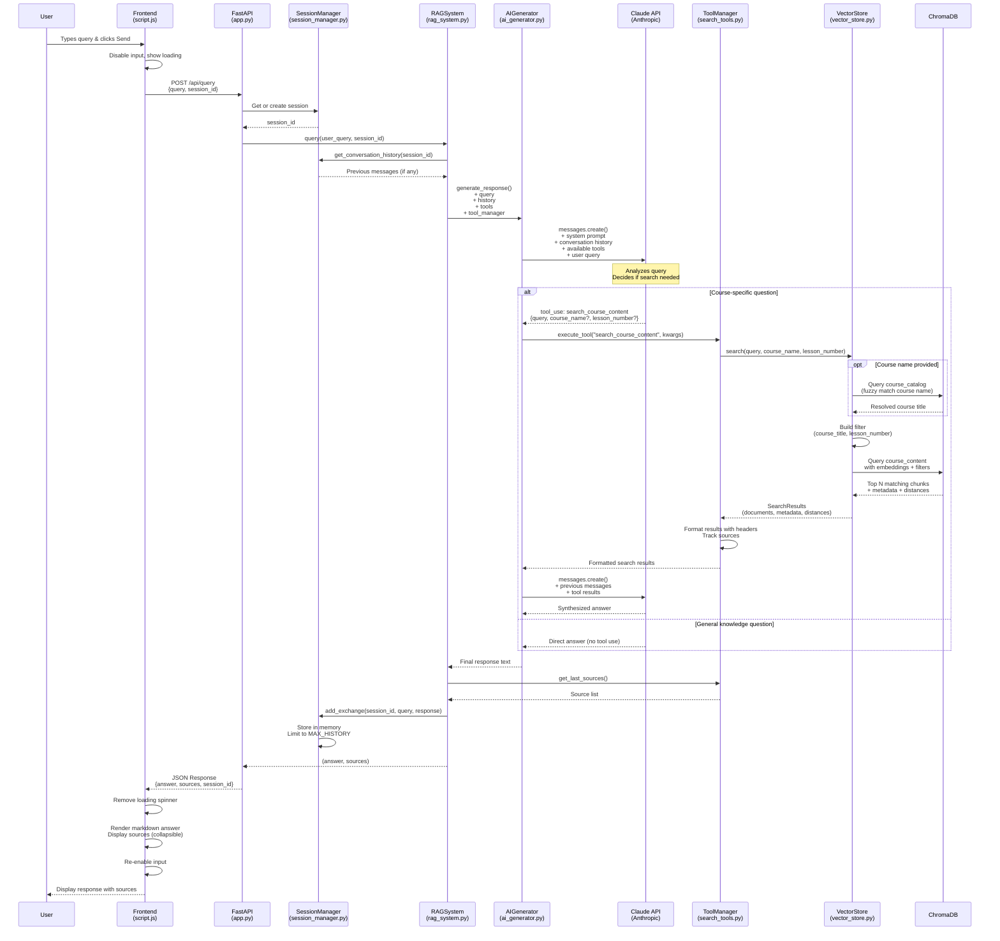
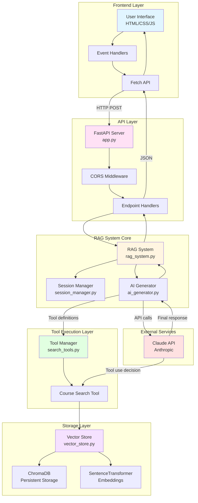
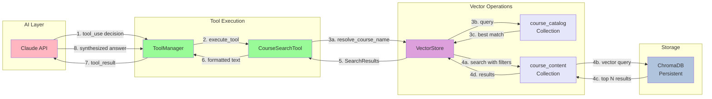
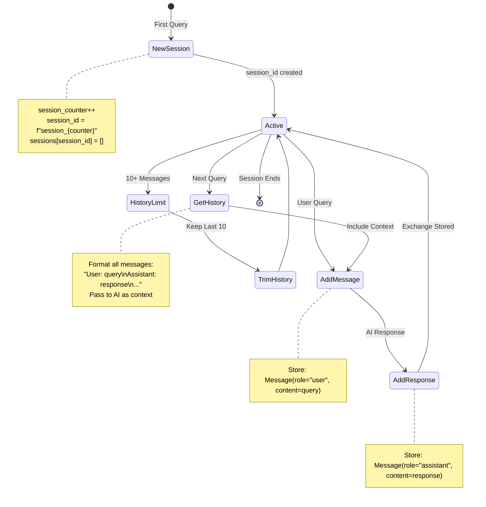
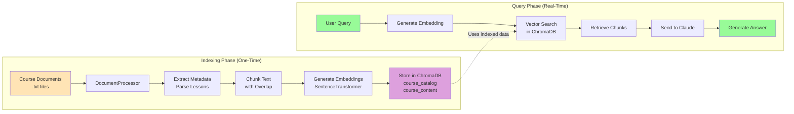
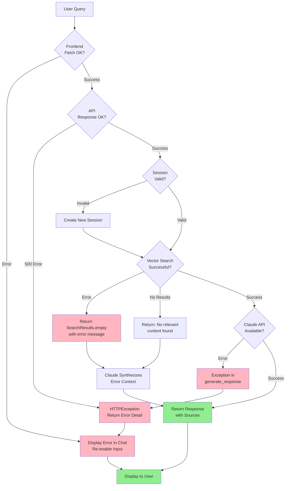

# Query Flow Diagram

This document contains visual diagrams illustrating how user queries flow through the RAG chatbot system.

## Sequence Diagram: Complete Query Flow



## Architecture Diagram: System Components



## Data Flow Diagram: Query Processing

```mermaid
flowchart TD
    Start([User Submits Query]) --> Input[User Input: What is prompt caching?]

    Input --> FE[Frontend Processes]
    FE --> |POST Request|API[API Endpoint /api/query]

    API --> CheckSession{Session<br/>Exists?}
    CheckSession -->|No| CreateSession[Create New Session]
    CheckSession -->|Yes| GetHistory[Get Conversation History]
    CreateSession --> GetHistory

    GetHistory --> PreparePrompt[Prepare AI Request<br/>+ System Prompt<br/>+ History<br/>+ Tools<br/>+ Query]

    PreparePrompt --> Claude1[Claude API Call #1]

    Claude1 --> Decision{Tool Use<br/>Needed?}

    Decision -->|No| DirectAnswer[Claude Returns<br/>Direct Answer]

    Decision -->|Yes| ToolCall[Claude Requests:<br/>search_course_content<br/>query: prompt caching]

    ToolCall --> ResolveCourse{Course Name<br/>Provided?}

    ResolveCourse -->|Yes| FuzzyMatch[Vector Search in<br/>course_catalog<br/>for course name]
    ResolveCourse -->|No| BuildFilter[Build Filter<br/>lesson_number only]
    FuzzyMatch --> CourseTitle[Resolved Course Title]
    CourseTitle --> BuildFilter

    BuildFilter --> VectorSearch[Vector Search in<br/>course_content<br/>with filters]

    VectorSearch --> Embeddings[Generate Query Embedding<br/>SentenceTransformer]
    Embeddings --> ChromaQuery[ChromaDB Query<br/>Cosine Similarity<br/>Top 5 Results]

    ChromaQuery --> Results[Search Results:<br/>- Documents<br/>- Metadata<br/>- Distances]

    Results --> Format[Format Results<br/>Add Headers<br/>Track Sources]

    Format --> ToolResult[Return Formatted<br/>Results to Claude]

    ToolResult --> Claude2[Claude API Call #2<br/>with Tool Results]

    Claude2 --> Synthesize[Claude Synthesizes<br/>Answer from Results]

    Synthesize --> DirectAnswer

    DirectAnswer --> SaveHistory[Save to Session:<br/>User Query<br/>Assistant Response]

    SaveHistory --> ExtractSources[Extract Sources<br/>from Tool Manager]

    ExtractSources --> Response[Build API Response:<br/>answer<br/>sources<br/>session_id]

    Response --> RenderFE[Frontend Renders:<br/>- Markdown to HTML<br/>- Add Sources<br/>- Remove Loading]

    RenderFE --> Display([Display to User])

    style Start fill:#90EE90
    style Display fill:#90EE90
    style Claude1 fill:#FFB6C1
    style Claude2 fill:#FFB6C1
    style ChromaQuery fill:#DDA0DD
    style VectorSearch fill:#DDA0DD
    style Decision fill:#FFD700
    style ResolveCourse fill:#FFD700
```



## Component Interaction Diagram: Tool-Based Search



## Session Management Diagram



## Vector Search Flow

```mermaid
flowchart TD
    Query[User Query:<br/>What is prompt caching?]

    Query --> Embed[Generate Embedding<br/>SentenceTransformer<br/>384-dim vector]

    Embed --> Compare[Compare with<br/>All Chunk Embeddings<br/>Cosine Similarity]

    Compare --> Filter{Filters<br/>Applied?}

    Filter -->|course_title| FilterCourse[Filter: course_title = X]
    Filter -->|lesson_number| FilterLesson[Filter: lesson_number = Y]
    Filter -->|both| FilterBoth[Filter: both conditions]
    Filter -->|none| NoFilter[No filtering]

    FilterCourse --> Rank
    FilterLesson --> Rank
    FilterBoth --> Rank
    NoFilter --> Rank

    Rank[Rank by Similarity<br/>Lower distance = Better]

    Rank --> TopN[Select Top 5 Results]

    TopN --> Results[Return:<br/>- Chunk content<br/>- Metadata<br/>- Distance scores]

    Results --> Format[Format with Context:<br/>[Course - Lesson N]<br/>chunk content...]

    style Query fill:#FFE4B5
    style Embed fill:#E0FFFF
    style Compare fill:#FFE4E1
    style Rank fill:#F0E68C
    style Results fill:#98FB98
```

## Document Processing vs Query Flow



## Error Handling Flow



---

## How to View These Diagrams

### Option 1: GitHub/GitLab
Push this file to a repository and view it on GitHub or GitLab - they render Mermaid diagrams automatically.

### Option 2: VS Code
Install the "Markdown Preview Mermaid Support" extension:
1. Open VS Code
2. Press `Ctrl+P` (Windows/Linux) or `Cmd+P` (Mac)
3. Type: `ext install bierner.markdown-mermaid`
4. Open this file and press `Ctrl+Shift+V` to preview

### Option 3: Online Mermaid Editor
1. Visit https://mermaid.live/
2. Copy any diagram code and paste it into the editor
3. See real-time rendering and export as PNG/SVG

### Option 4: Obsidian
Open this file in Obsidian - it has native Mermaid support.

---

## Diagram Descriptions

### 1. Sequence Diagram
Shows the chronological interaction between all components from user input to display. Best for understanding the order of operations.

### 2. Architecture Diagram
Shows the static structure of the system with all major components and their relationships. Best for understanding system organization.

### 3. Data Flow Diagram
Shows how data transforms as it moves through the query processing pipeline. Best for understanding data transformations.

### 4. Component Interaction Diagram
Focuses specifically on the tool-based search mechanism. Best for understanding RAG retrieval.

### 5. Session Management Diagram
Shows the state machine for conversation sessions. Best for understanding how history is maintained.

### 6. Vector Search Flow
Details the embedding and similarity search process. Best for understanding the core RAG retrieval mechanism.

### 7. Document Processing vs Query Flow
Compares the indexing phase with the query phase. Best for understanding the difference between setup and runtime.

### 8. Error Handling Flow
Shows all error paths and recovery mechanisms. Best for understanding system reliability.
